# MakeCode Arcade 2026 Update

**Posted on February 13th, 2026 by [Jaqster](https://github.com/jaqster)**

Today we are pleased to release our 2026 MakeCode Arcade updates!

We know it's the middle of the school year for many, so if you would like to continue using the existing version, you can bookmark https://arcade.makecode.com/v2.0.

## Reliability & Stability

One of our big focus areas for this release was the reliability and stability of the product. So, although this is an invisible feature, we did a lot of back-end work to ensure that students don't lose work or progress. If you do find any issues like this, please log a [GitHub issue](https://github.com/microsoft/pxt-arcade/issues), or post on the [Forum](https://forum.makecode.com) (See the posting about ["What to do when you encounter a bug"](https://forum.makecode.com/t/what-to-do-when-you-encounter-a-bug/35120)). We hope these improvements help keep MakeCode the product that always "just works"!

## Code Evaluation

Last year, we introduced the [Code Evaluation](https://makecode.com/blog/tools/code-eval-tool) tool for the micro:bit as a way to help teachers understand and evaluate student programs. We've learned a lot over the past year and are now bringing this tool to MakeCode Arcade. We are still learning how best to support teachers in evaluating and assessing student programs while preserving creativity and self-expression.

Here's a quick overview video of how the tool works –

https://youtu.be/XnFaELem5-o

Please try it out yourself and let us know what you think by clicking on the Feedback button.

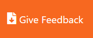

You can get to the tool directly at https://arcade.makecode.com/--eval, or click on the Evaluate button in the top right corner of any shared project page.

## Error Explainer

Have you ever encountered the dreaded red outline or underline in your code that lets you know that something's not right? Now when that happens, you're not alone in debugging! There's a helpful "Error Explainer" that can walk you through bugs in your code.

When an error occurs in your project, a problems pane appears below the editor with the error message and an **Explain with AI** button that users can optionally click for a more comprehensive explanation of the error, as well as indicating where in their code the error occurs. This feature is available for both Blocks and Text editors. Please note that you do have to be signed into MakeCode Arcade for this feature.

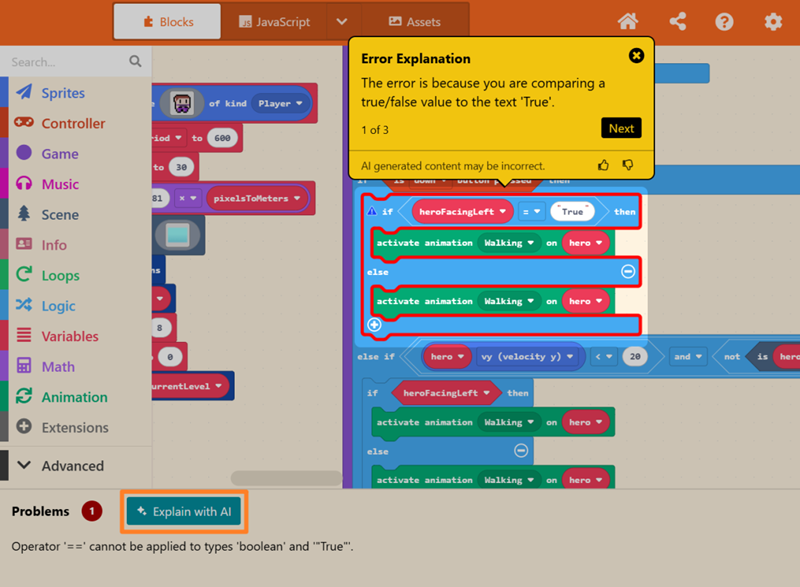

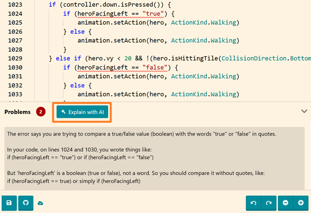

## Tutorial Sharing

My personal favorite feature for this release! Finally we have an easy way to share tutorials! This has been a long-time request of teachers looking for a way to assign tutorials to students. Now from the Home Page, you can click on a tutorial card and click the **Share** button to copy a link to the tutorial and paste it into your favorite LMS or classroom assignment tool.

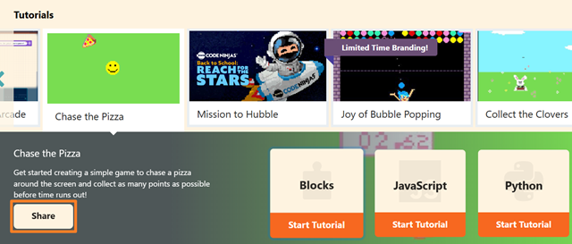

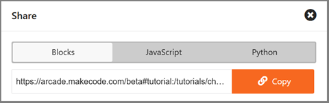

## Keyboard Controls

Arcade is our final editor to get the keyboard navigation feature that we worked on with the [Micro:bit Foundation](https://microbit.org/accessibility/blockly-accessibility-project) and [Blockly](https://developers.google.com/blockly/accessibility) last year. This feature is a wonderful accessibility improvement making block-based coding accessible for people who need or prefer to use a keyboard instead of a mouse.

To turn on the keyboard controls, in the MakeCode editor, click on the **Settings** (⚙️) menu and select 'Keyboard Controls'.

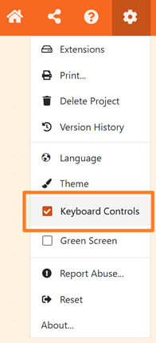

You can also just press the **Tab** key when you open the editor to get the shortcut menu and then select **Enter**.

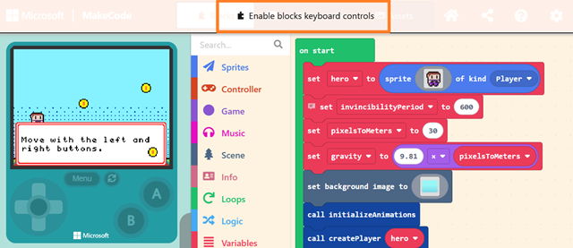

When you activate keyboard controls, a help pane will appear with information on the keys to press to navigate around the editor. **Ctrl B** also shows you screen region shortcuts for keyboard navigation.

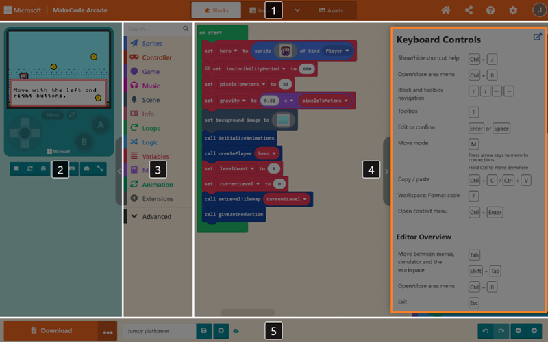

## Game Description

Have you ever wanted to include more description or instructions for your game, but don't want to put it all in the splash screen? Now in the "Share Project" window, there's a nice big description field that allows you to enter details about your game so other people have a bit more context before they jump right into playing.

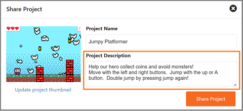

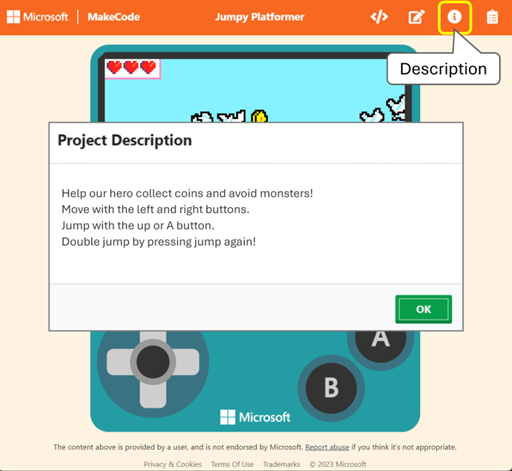

## Asset Packs

Who loves pixel artists?! I do!!! And I love using community shared pixel art in my games. Now there's an easier way to share assets. You can create a project full of custom assets, and in the "Project Settings" window, toggle the **Asset Pack** setting to on. This will allow other people to import the assets from your project, just like they would an extension.

Watch this video to see how it's done –

<-AssetPackWalkthru YouTube link->

## Tilemap Gallery

We have a gallery of images, animations, and tiles... and now we have a gallery of pre-built tilemaps too! These are quite beautiful and useful to get started creating tilemap games. Of course, your own custom tilemaps are the best, but these can help you plan and ideate on that dungeon crawler game you've always wanted to build!

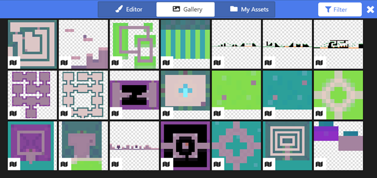

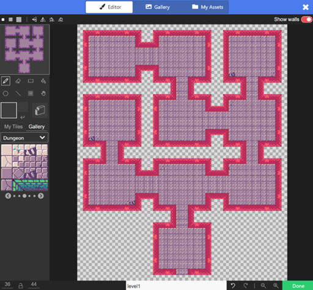

## YouTube Education video player

Something you may not notice right away, but that educators will appreciate – we've switched out our regular YouTube player for embedded videos to YouTube's Player for Education which improves student privacy, safety and gives us an ad-free experience. Look Ma! No ads!

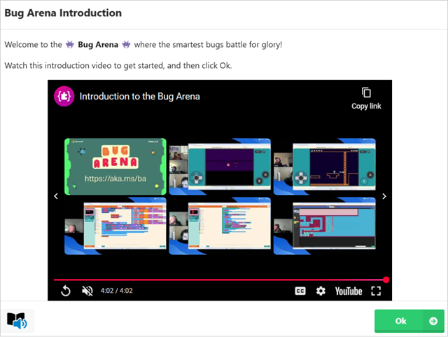

## Game window fullscreen

Students love playing their games in fullscreen mode. Alas, many of them don't even know this view exists! So we have made some improvements to hopefully help with discoverability and being able to move back and forth between the code editor and the game window fullscreen. We changed the icon to be arrows (similar to the YouTube buttons), and we now also support the **Escape** shortcut key as a way to exit fullscreen mode.

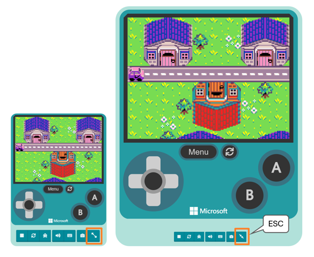

## New blocks

We have a couple new code blocks for this release.

### 'unfollow' block

The [unfollow](https://arcade.makecode.com/reference/sprites/sprite/unfollow) block will do exactly what you think. Once you have a sprite that's set to follow another sprite, this block will stop the sprite from following.

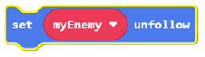

### Math Constants

The Math Constants block contains some helpful values like **Pi (π)**, **_e_**, and some square root and logarithmic values.

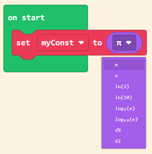

## New Extensions

There are over 30 officially supported extensions for MakeCode Arcade, and we're adding more! Here are three new extension updates that make building the games of your dreams much easier.

### Character Animations

The [Character Animations](https://arcade.makecode.com/pkg/microsoft/arcade-character-animations) extension provides fine-grain control over when animations run on a sprite. For example, you can create specific animations for when your sprite is moving or facing certain directions.

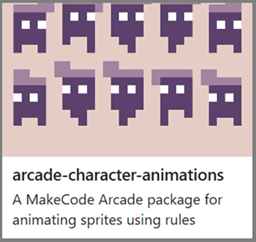

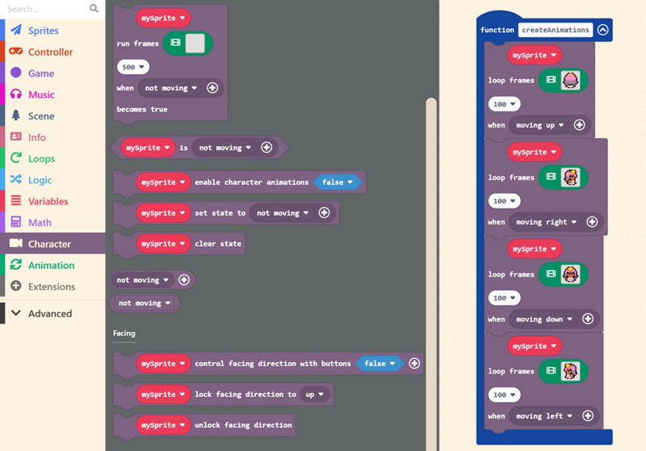

### Tile Scanner

The [Tile Scanner](https://arcade.makecode.com/pkg/riknoll/arcade-tile-scanner) extension is super helpful for Tilemap games! You can use one block to scan your entire tilemap to select groups of common tiles using a variety of different rules.

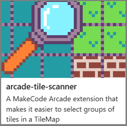

Here are a couple examples where you can use it to select the location of all grass blocks in your tilemap, or the location of all contiguous matching tiles.

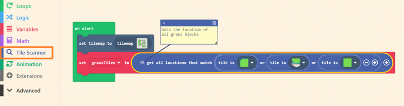

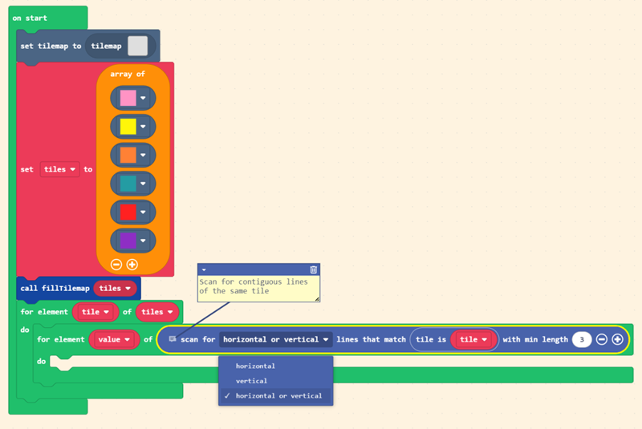

### Mini Menu

Let's add [Mini Menu](https://arcade.makecode.com/pkg/riknoll/arcade-mini-menu)! This has been an unofficial extension for a while and super popular! So, glad to finally welcome it to our official extension gallery. These blocks are all about helping you make menus in your game.

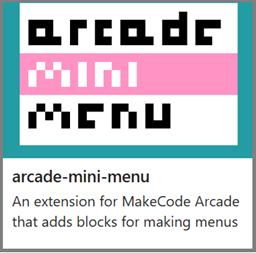

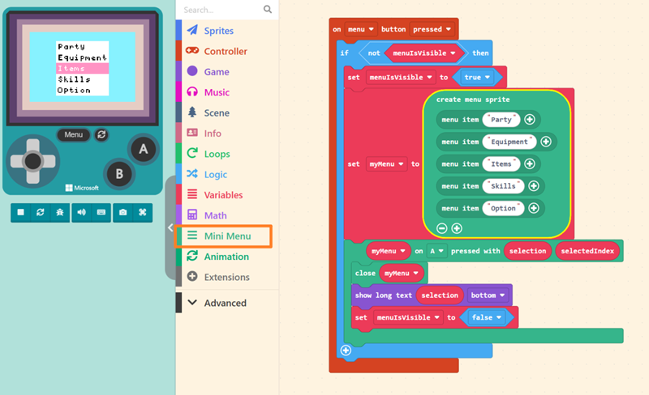

## New hardware

And we have some exciting new Arcade hand-held devices from our partners Forward Education and Elecfreaks. I'm so excited about the gorgeous big screens on these devices!

### CodeCTRL

[CodeCTRL for micro:bit]( https://forwardedu.com/products/codectrl-for-micro-bit) by Forward Education is nice and big, but also lightweight with an easy-to-use joystick.

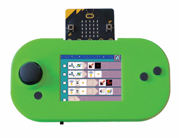

### micro:bit Arcade Pro

The [micro:bit Arcade Pro](https://shop.elecfreaks.com/products/elecfreaks-microsoft-makecode-micro-bit-arcade-pro) from Elecfreaks is one of the nicest feeling hand-held game devices I've ever used! The d-pad, buttons, large screen and shape all work together to provide a really enjoyable game experience.

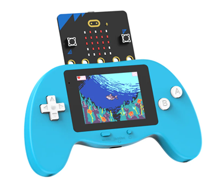

## Theme Change

One other change that we're waiting until summer to flip the switch on is our default theme change. In order to improve visual accessibility and color contrast, we'll be changing the default 'Arcade Orange' theme to the 'Blue Light' theme at the end of June. So, if you have screenshots or images in any curriculum or publications, please start the process of updating these. Note that if you are attached to the original orange theme, don't worry it's not going away. If you log in to use MakeCode, we save your preferred theme setting in your user preferences.

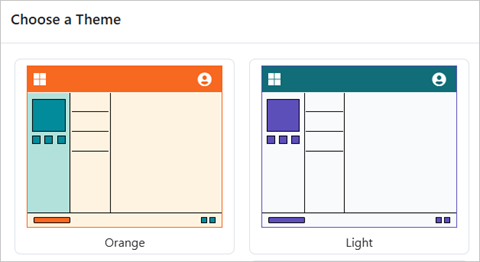

Thank you to everyone who has logged bugs, submitted PR's, translated and suggested new features! Any new bugs you find in this release, please log them in GitHub: https://github.com/Microsoft/pxt-arcade/issues

Any other questions, comments, suggestions, and feedback – please join the discussion at the [MakeCode Forum](https://forum.makecode.com).

Happy Making and Coding!

 
The MakeCode Team
