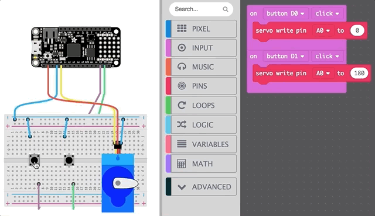
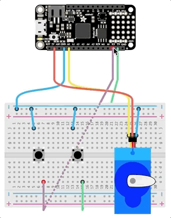
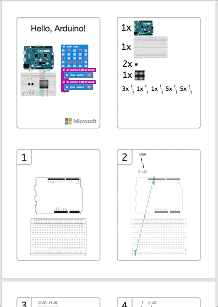

# Code First
Many devices supported by MakeCode, 
such as the [micro:bit](http://makecode.microbit.org/) and 
the [Adafruit Circuit Playground Express](http://makecode.adafruit.com/),
have a set of built-in sensors and outputs. But
Arduino-style boards require wiring of sensors and actuators
to the board's header pins. The user selects a set
of parts, wires them up to the board and then codes the system they have made. 

In MakeCode for makers, we turn this paradigm on its head: MakeCode's simulator
selects basic parts and generates wiring for them from the user's program.
That is, the user expresses the behavior that they want
with code, and MakeCode uses that code to configure the simulator, as well as to
generate the make instructions that can be printed out. 
This experience is great for beginners to the Arduino style of making. 

Most tutorials and kits out there have you wire everything together 
before you can experience the behavior. MakeCode requires no knowledge of how 
breadboards work or how the individual components are wired.
Users can rapidly prototype many different behaviors and the hardware follows along. 
A process that would be much more cumbersome 
if users had to manually assemble the hardware.
Users also don't need to own the parts to see it work.

## Example: Play a tune
Above is a simple example: the user creates a two-block program to play a tune when a button is pressed. 
MakeCode detects the hardware requirements from the two blocks: an audio player and a button are needed. 
MakeCode then automatically chooses hardware, lays it out, wires it, and provides a simulation.
The button can be clicked with a mouse to play the tune in the browser.

# Breadboard Simulator

The simulator provides an interactive experience:
the buttons are clickable, servos are animated, and audio comes out of the web app.
There's a lot of detail and learning opportunities available in the simulator.

Hovering over the breadboard shows you how it's connected internally, while
hovering over wires shows how the component connects.

Users might notice that the speaker and button don't require a connection to positive voltage, while the servo, knob, and LEDs do. 
MakeCode isn't explicitly teaching this (today), but users can make connections on their own.
They experience hardware in a way that is usually only achievable by having the 
hardware in front of you.

The breadboard simuulator is useful to more people than just beginners:
debugging program behavior is much quicker in a simulator, so
the "inner loop" of development is rapidly sped up.

# Assembly Instructions

For every project, MakeCode can generate a PDF file with step-by-step instructions that 
correspond to the parts and wiring shown in the breadboard
simulator. 
This tailored file lists the set of parts required, guides
the user step-by-step and part-by-part to build the final system. 

This on-demand instruction generation is great for use in the eduction
and can support teachers in rapidly developing and modifying projects
for the classroom. There's no need to wait for the next version of a kit -
you can just change the code and print new instructions.

As in every aspect of MakeCode, there are opportunities to learn here.
A completed project can look like a daunting mess of wires.
The assembly instructions let you learn about a project one step at a time.
Some users might feel intimidated working with batteries.
It's not obvious what the rules are: what is allowed to connect to what? What can be damaged?
The assembly instructions take users on a safe route and include printed warnings 
if there is something tricky or easy to make a mistake on.

# Help us expand maker.makecode.com!
We welcome pull requests! Here are some ideas for the future:

There many more possible learning opportunities:
on-hover or other hints can be added to individual components, the breadboard, the logic board, pins, and more;
these learning hints could also be printed in the assembly instructions.

Parts purchasing could be made trivial. Once the user is happy with their project in the simulator, 
they could click a button to generate a shopping list that could be fulfilled at a number of electronic hardware retailers.

With community help, it's conceivable that MakeCode could automatically generate a custom PCB for your project.
Going even further, perhaps the entire project could be shipped to the user fully 
assembled with the software already loaded onto it. This would democratize electronics in a whole new way.
